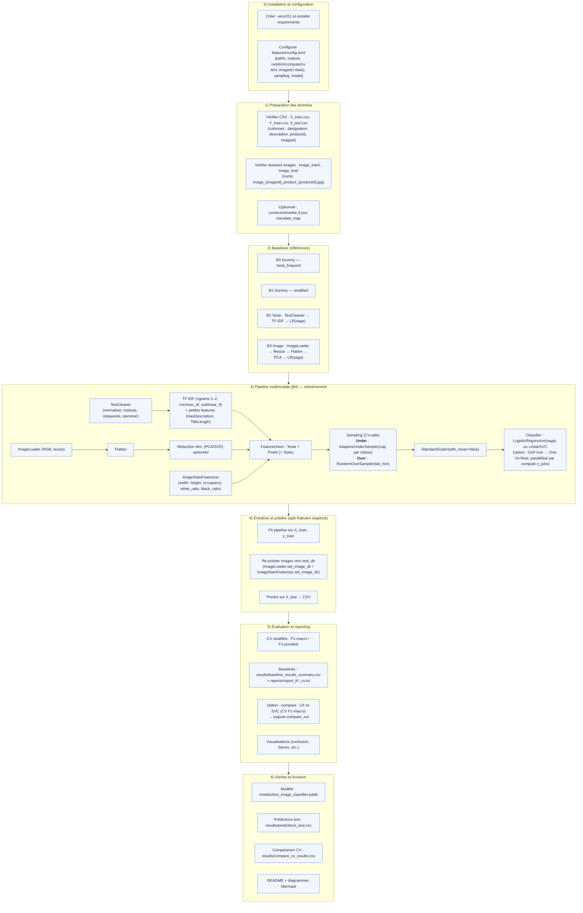
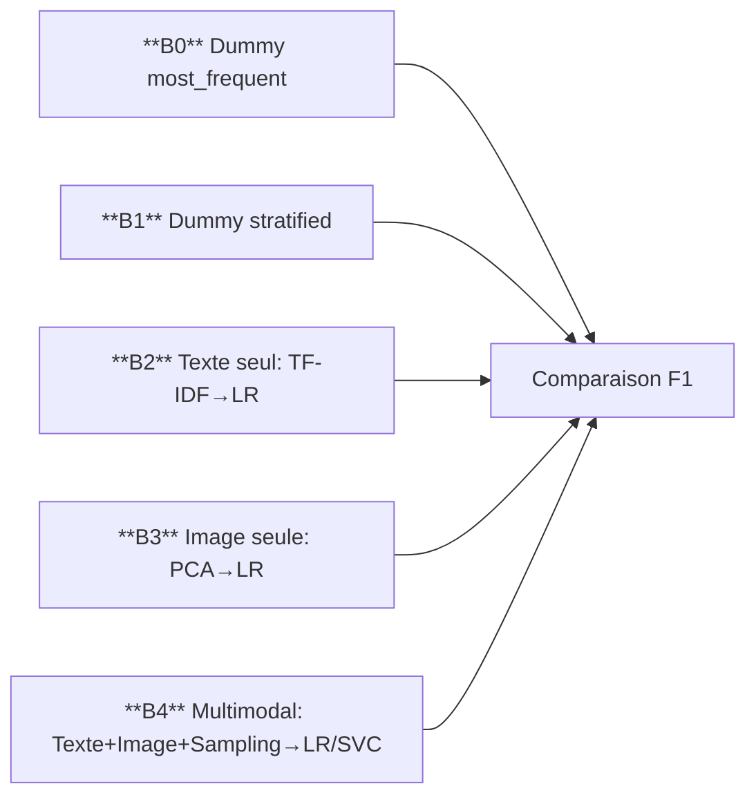

# Rakuten Product Classification – DataScientest x Mines Paris


## Presentation  


Ce projet s’inscrit dans le cadre de la formation **DataScientest – Mines Paris** et du challenge proposé par **Rakuten Institute of Technology** via la plateforme Challenge Data en partenariat avec le **Collège de France**. Il vise à **automatiser la classification des produits vendus sur la marketplace Rakuten** France en s’appuyant à la fois sur des **données textuelles** (titres, descriptions) et **visuelles** (images produits).
Pipeline multimodale texte + image, **configuration centralisée via TOML**, rééquilibrage CV‑safe, et comparaison LR vs LinearSVC.


## Objectifs

- Construire un modèle de classification supervisée multimodal (texte + image) pour prédire la catégorie prdtypecode des produits.

- Traiter les défis liés au déséquilibre des classes, à la diversité linguistique et à l’hétérogénéité des visuels.

- Proposer une structuration sémantique des catégories pour faciliter l'expérience utilisateur et optimiser la navigation.

-L’approche est multimodale : une branche texte (nettoyage + TF-IDF) et une branche image (chargement, normalisation, PCA), fusionnées puis apprises par un classifieur linéaire, avec rééquilibrage des classes (undersampling/oversampling).

## Methodologie

### Exploration et Préprocessing

- Fusion des données texte et visuelles via imageid et productid

- Traitement des valeurs manquantes (35% de description manquantes)

- Construction d’un dictionnaire de mots vagues multilingues pour améliorer les visualisations

- Création de colonnes auxiliaires (ex. image_name) pour faciliter les jointures

#### Visualisation

- Nuages de mots bruts et nettoyés

- Affichage d’images par catégorie

- Diagrammes de distribution des classes (déséquilibrées)

- Arborescence thématique (ex. : Jeux & gaming > Accessoires gaming)

#### Observations et résultats de l'étape EDA

- 27 catégories identifiées dans Y_train, très déséquilibrées (de 764 à 10 209 produits)

- Définition d’un nom standardisé des catégories inspiré des marketplaces

- Structuration de 8 thématiques principales (Jeux & Gaming, Livres & Presse, Maison & Jardin, etc.)

- Mise en place d’un pipeline pour visualiser, nettoyer, et interpréter les données

#### Prochaines étapes

- Entraînement d’un modèle de classification multimodale (texte + image)

- Mise en place d’un modèle en cascade : d’abord prédiction de la thématique, puis de la catégorie

- Évaluation via F1-score pondéré pour gérer le déséquilibre des classes

- Déploiement en démonstration Streamlit

### Diagramme



### Feature Engineering

#### A — Traitement du texte – Pipeline Rakuten

##### 1) Objectif
Exploiter le texte produit (**designation** + **description**) pour **prédire la catégorie** :
- **Nettoyer** les chaînes (retirer le bruit, harmoniser).
- **Représenter** en TF-IDF exploitable par des modèles linéaires.
- **Enrichir** avec des signaux simples (ex. présence d’une description).

##### 2) Sources utilisées
- **designation** : nom du produit.  
- **description** : texte descriptif.

> **Remarque** : l’existence d’une description est informative. D’où la feature binaire `has_description`.

##### 3) Étapes de traitement

###### 3.1) Fusion & indicateur `has_description`
- **Fusionner** `designation` et `description` en un texte unique (ex. `full_text`).  
- **Ajouter** `has_description = 1` si `description` non vide, sinon `0`.  
→ **Maximiser** l’information lexicale + **capturer** un signal simple de complétude.

###### 3.2) Nettoyage avec `TextCleaner`
- **Retirer** le HTML (balises `<...>`, entités `&amp;`, `&#39;`, …).
- **Normaliser** (minuscules, ponctuation, caractères non alphanumériques).
- **Supprimer** les stopwords (NLTK) — penser à `nltk.download('stopwords')`.
- **Traduire** via un **translate_map** optionnel (ex. EN/DE → FR) si fourni.
- **Stemmer** (Snowball FR) pour réduire la variance morphologique.

###### 3.3) Vectorisation TF-IDF (`TextTfidfVectorizer`)
- **`max_features`** : taille du vocabulaire (ex. **100 000** en prod).
- **`ngram_range = (ngram_min, ngram_max)`** :
  - 1-gram : *chaussure*, *cuir* ; 2-gram : *acier inox*, *coque iphone*.
  - **Capturer** vocabulaire général + expressions composées.
- **`min_df` / `max_df`** : filtrer termes **trop rares** / **trop fréquents** (ex. 2 / 0.95).
- **`sublinear_tf = true`** : transformer TF en `1 + log(tf)` pour **réduire l’impact** des répétitions.
- **`strip_accents = 'unicode'`** : homogénéiser accents.
- **`lowercase = False`** : déjà géré par `TextCleaner`.
- **`dtype = float64`** : **éviter** le warning sklearn (conversion depuis float32).

**Exemple TOML — section `[text]`**
```toml
[text]
max_features = 100000
ngram_min = 1
ngram_max = 2
min_df = 2
max_df = 0.95
sublinear_tf = true
use_stem = true
translate_map_path = "features/translate_map.json"
# options avancées
norm = "l2"
strip_accents = "unicode"
stop_words = null   # "french" / ["the","and",...] / null
```

**Exemple d’appel côté code**

from models.text_pipeline import create_text_pipeline_from_cfg
text_branch = create_text_pipeline_from_cfg(cfg.get("text", {}))

#### B — Traitement d’images (chargement, redimensionnement, encodage)

##### 1) Objectif
Représenter l’information visuelle sous forme de vecteurs utilisables par des modèles linéaires.

##### 2) Étapes
- **Charger** via `ImageLoader` (noms : `image_{imageid}_product_{productid}.jpg`).
- **Convertir** en **RGB** et **redimensionner** à `images.size` (TOML).
- **Aplatir** (flatten) pour obtenir un vecteur de pixels.
- **Gérer** les images manquantes → **vecteur nul** (image noire) afin de ne pas casser la pipeline.
- **(Option)** **réduire** la dimension (section C).

##### 3) Exemple TOML — section `[images]`
```toml
[images]
train_dir = "data/images/images/image_train"
test_dir  = "data/images/images/image_test"
size = [64, 64]

[images.dim_reduction]
enabled = true
method = "pca"      # "pca" conseillé pour pixels denses (images)
n_components = 100
random_state = 42
```

#### C — Réduction de dimension (PCA / SVD)

##### 1) Objectif
Réduire la **dimension** des vecteurs d’images pour :
- **accélérer** l’entraînement et la CV,
- **limiter** la mémoire,
- **stabiliser** le modèle (moins de bruit, moins d’overfit),
tout en **conservant l’essentiel** de l’information visuelle.

##### 2) Quand et pourquoi
- Les pixels aplatís sont **denses** → privilégier **PCA** (dense).
- Les matrices **creuses** (ex. TF-IDF texte) préfèrent **TruncatedSVD** (LSA).
- Utiliser la réduction surtout quand `images.size` augmente (64×64, 96×96…).

##### 3) Méthodes
- **PCA** : décomposition sur données **denses** (images).  
- **TruncatedSVD** : décomposition sur matrices **creuses** (texte).  
> Dans ce projet, la réduction porte sur les **pixels** → **PCA** recommandée.

##### 4) Paramétrage TOML
```toml
[images]
size = [64, 64]                   # 32×32 en dev ; 64×64 en prod

[images.dim_reduction]
enabled = true                    # activer/désactiver la réduction
method = "pca"                    # "pca" (images denses) | "svd" (matrices creuses)
n_components = 100                # 50–80 (dev), 80–120 (prod) selon budget
random_state = 42                 # reproductibilité
```

##### 5) Exemple côté code (pipeline images)**

# Dans train_model.py (extrait)
from models.image_pipeline import create_image_pipeline

image_pixels = create_image_pipeline(
    image_dir=cfg["images"]["train_dir"],
    image_size=tuple(cfg["images"]["size"]),                 # ex. (64, 64)
    dim_reduction=cfg.get("images", {}).get("dim_reduction", {})

##### 6) Conseils performance / mémoire

- **Dev rapide** : size=[32,32] + n_components=50–80 → itérations rapides.
- **Prod** : size=[64,64] + n_components=80–120 → meilleur compromis précision/temps.
- **Surcoût PCA** : croît avec n_components et la taille d’image ; ajuster si la CV devient lente.
- **Standardiser après sampling** (dans la pipeline globale) pour scaler ce que voit réellement le modèle.

##### 7) Contrôles rapides

- **Vérifier la forme** : après FeatureUnion, contrôler que la dimension baisse bien quand enabled=true.
- **Fixer la seed** : random_state dans [images.dim_reduction] pour des runs reproductibles.
- **Surveillance overfit** : trop grand n_components peut réintroduire du bruit → suivre F1-macro CV.

#### D — Features statistiques d’image (objet sur fond)

##### 1) Objectif
Capturer des **indices globaux** de l’objet photographié (taille, occupation, contraste) qui
complètent les pixels bruts. Ces signaux sont **peu coûteux** et souvent **robustes** aux variations.

##### 2) Principe
- **Binariser** l’image en trois zones sur l’échelle de gris 0–255 :
  - **Noir** ≤ `black_threshold` (ex. 25)
  - **Blanc** ≥ `white_threshold` (ex. 230)
  - **Objet** = le **reste** (pixels intermédiaires)
- **Filtrer** les petites composantes (`min_area`) pour éviter le bruit.
- **Mesurer** sur l’objet principal :
  - `width`, `height`  → dimensions de l’enveloppe
  - `occupancy`        → ratio surface_objet / surface_image ∈ [0,1]
- **Calculer** des indicateurs de contraste global :
  - `white_ratio` → proportion de pixels « blancs »
  - `black_ratio` → proportion de pixels « noirs »

> Formule : `occupancy = nb_pixels_objet / (H × W)`

##### 3) Paramétrage via TOML
```toml
[images.stats]
enabled = true          # activer la branche stats
white_threshold = 230   # seuil "blanc" (fond clair)
black_threshold = 25    # seuil "noir"
min_area = 16           # ignorer les composantes trop petites
out_prefix = "auto"     # nommer les colonnes en incluant les seuils (ex. img_w230_b25_*)
```

##### 4) Intégration dans la pipeline

- Placer la branche ImageStatsFeaturizer dans le FeatureUnion (avec texte & pixels).
- Rééchantillonner ensuite (under adaptatif → over), puis scaler.
- Re-pointer le dossier test avant la prédiction (set_image_dir).

**Extrait (entraînement)**

from features.image_stats import ImageStatsFeaturizer

stats_cfg = cfg.get("images", {}).get("stats", {})
if bool(stats_cfg.get("enabled", False)):
    image_stats = ImageStatsFeaturizer(
        image_dir=cfg["images"]["train_dir"],
        imgid_col="imageid",
        pid_col="productid",
        white_threshold=int(stats_cfg.get("white_threshold", 230)),
        black_threshold=int(stats_cfg.get("black_threshold", 25)),
        min_area=int(stats_cfg.get("min_area", 16)),
        out_prefix=str(stats_cfg.get("out_prefix", "auto")),
    )
    transformers.append(("image_stats", image_stats))  # ← ajouté au FeatureUnion

##### 5) Bonnes pratiques

- **Adapter les seuils** : 230/25 marchent bien sur fonds clairs ; diminuer white_threshold
si les images sont globalement sombres, ou augmenter black_threshold si le fond est gris.
- **Vérifier la distribution des features** (histos de occupancy, white_ratio, black_ratio) sur un échantillon.
- **Corréler avec les classes pour repérer les signaux utiles** (ex. catégories “livres” vs “high-tech”).
- **Désactiver rapidement la branche** en mettant enabled=false (ablation study).
- **Laisser out_prefix="auto"** pour tracer facilement quels seuils ont servi dans un run.

#### E — Approche multimodale : fusion & sampling

##### 1) Objectif
Combiner **texte** + **pixels** + **stats d’image** dans une même pipeline, puis **rééquilibrer** les classes
de façon **CV-safe**, **standardiser** et **entraîner** un classifieur linéaire robuste (LR ou LinearSVC).

---

##### 2) Flow d’entraînement (résumé)
1. **Texte** : `TextCleaner` → `TF-IDF` (+ `HasDescriptionFlag`, `DesignationLength`)
2. **Images (pixels)** : `ImageLoader` → `Resize` → `Flatten` → **(option)** PCA/SVD
3. **Stats image** : `ImageStatsFeaturizer` (5 features globales)
4. **Fusion** via `FeatureUnion` (**texte + pixels + stats**)
5. **Sampling** :
   - **Under** : `AdaptiveUnderSampler` (cap par classe **recalculé par fold** → **CV-safe**)
   - **Over**  : `RandomOverSampler` (remonter les classes sous `tail_min`)
6. **Scaler** : `StandardScaler(with_mean=false)` **après** sampling
7. **Classifier** : `LogisticRegression(saga)` **ou** `LinearSVC`
   - Option **OvR** (`ovr=true`) : **One-Vs-Rest**, parallélisé par `[compute].n_jobs`

> **Éviter** de combiner `class_weight="balanced"` **et** les samplers (double compensation).

---

##### 3) Paramétrage TOML
```toml
[sampling]
major_class = 2583   # id de la classe majoritaire
major_cap   = 6000   # plafond d'under pour cette classe (cap par fold)
tail_min    = 1500   # seuil d'over pour classes rares

[model]
name = "lr"          # "lr" ou "svc"
use_class_weight = false
solver = "saga"
C = 1.0
max_iter = 3000
tol = 0.001
ovr = false          # true → One-Vs-Rest (parallélisé)

[compute]
n_jobs = 1           # paralléliser la CV et l’OvR

[cv]
splits = 3
shuffle = true
random_state = 42
```
##### 4) Bonnes pratiques & garde-fous

- **Sampler vs class_weight **: choisir l’un ou l’autre, éviter les deux en même temps.
- **CV-safe** : utiliser l’under adaptatif (cap par fold) pour éviter les ValueError d’imblearn.
- **Ordre des steps**: features → under → over → scaler → model.
- **OvR** : utile si beaucoup de classes et classes rares ; paralléliser via [compute].n_jobs.
- **Temps/ram** : réduire text.max_features, images.dim_reduction.n_components si l’entraînement est trop long.
- **Reproductibilité** : fixer [random].seed et [cv].random_state.

##### 5) Contrôles rapides

- **Sanity check sampling** : logger les effectifs par classe avant/après sampling sur un fold.
- **Forme des features** : vérifier la dimension de FeatureUnion (ex. fit_transform sur un mini batch).
- **Ablations** : comparer stats.enabled=false/true, ovr=false/true, svc vs lr pour le rapport.

#### F- Architecture du projet

Architecture du projet
.
- ├── data/
- │   ├── X_train_update.csv
- │   ├── Y_train_CVw08PX.csv
- │   └── X_test_update.csv
- │
- ├── data/images/images/
- │   ├── image_train/   # images d'entraînement
- │   └── image_test/    # images de test
- │
- ├── features/
- │   ├── text_cleaner.py
- │   ├── text_vectorizer.py
- │   ├── image_loader.py
- │   ├── image_stats.py
- │   ├── make_cleaned_frequencies_and_map.py
- │   └── config.toml          # configuration centrale du projet
- │
- ├── main/
- │   └── train_model.py       # orchestration (baselines, CV, pipeline complet)
- │
- ├── models/                  # pipelines pour texte et image
- ├── results/                 # métriques & figures (sorties baselines)
- ├── tools/                   # scripts de reporting (figures)
- │   ├── plot_baselines.py
- │   ├── plot_baseline_bars.py
- │   └── plot_confusion_matrix.py
- └── README.md

#### G- Baselines & Protocole d’évaluation

Nous évaluons 5 références avant/après le multimodal :

- Code	    Baseline	        Description
- B0	        Naïf (majoritaire)	DummyClassifier(strategy="most_frequent")
- B1	        Naïf (stratifié)	DummyClassifier(strategy="stratified")
- B2	        Texte seul	        TextCleaner + TF-IDF → LR (sans rééchantillonnage)
- B3	        Image seule	        ImageLoader → flatten → PCA → LR (sans texte)
- B4	        Multimodal complet	Texte + Image (+ image_stats) + under/over-sampling (pipeline principal)

- Métriques : F1 macro (équité inter-classes) & F1 pondéré.
- Validation : K-fold stratifié (paramétré via TOML).
- Reproductibilité : random_state fixés; config centralisée.




#### H- Comment exécuter le projet

##### Génération du dictionnaire et des fréquences (optionnel si déjà fait)
        python features/make_cleaned_frequencies_and_map.py 
        --x_train_csv data/X_train_update.csv 
        --out_freq features/token_frequencies_cleaned_stem.csv 
        --out_map features/translate_map_starter_from_cleaned.json 
        --config features/config.toml


##### Lancer les baselines

###### B0 / B1
python -m main.train_model --config features/config.toml --baseline b0
python -m main.train_model --config features/config.toml --baseline b1

###### B2 (texte seul)
python -m main.train_model --config features/config.toml --baseline b2

###### B3 (image seule)
python -m main.train_model --config features/config.toml --baseline b3

##### Lancer le modèle multimodal (B4)
python -m main.train_model --config features/config.toml
- Modèle sérialisé : outputs.model_out
- Prédictions test : outputs.pred_out

##### (Option) Comparer LR vs SVC (CV)
python -m main.train_model --config features/config.toml --compare
→ Résultats CSV : outputs.compare_out

##### Forcer le modèle côté CLI
python -m main.train_model --config features/config.toml --model svc
Écraser [model].name à la volée.

#### I- Visualisations & Rapports

- ##### 1) Barres (une métrique) – F1 macro par défaut
python tools/plot_baselines.py
###### autre métrique & sortie
python tools/plot_baselines.py --metric f1_weighted --out results/figures/baseline_f1_weighted.png

- ##### 2) Barres groupées – F1 macro vs F1 pondéré
python tools/plot_baseline_bars.py
###### imposer l’ordre : B0→B4
python tools/plot_baseline_bars.py --order B0 B1 B2 B3 B4

- ##### 3) Matrice de confusion (top-K classes)
###### Texte seul (B2), 3 folds, normalisée, top 25 classes
python tools/plot_confusion_matrix.py --config features/config.toml --baseline b2

###### Multimodal (B4), 5 folds, non normalisée, top 30
python tools/plot_confusion_matrix.py --config features/config.toml --baseline b4 --splits 5 --normalize false --topk 30


##### Sorties & Organisation des résultats

###### Baselines

- results/baseline_results_summary.csv – cumul des runs (append)
- results/report_b0_cv.txt, … – classification_report par baseline (CV)
- results/figures/*.png – bar charts & matrices de confusion (+ CSV agrégés)
- results/figures/baseline_f1_macro.png, baseline_f1_bars.png, …
- results/figures/cm_<baseline>.png + cm_<baseline>_full.csv + report_<baseline>_cv.txt

###### Modèle complet (B4)

- models/text_image_classifier.joblib – pipeline entraîné
- models/y_test_pred.csv – prédictions sur X_test
- models/compare_cv_results.csv – si --compare activé


#### J- Bonnes pratiques & Dépannage

- ##### Fixer les seeds ([random].seed) et le parallélisme ([compute].n_jobs).
- ##### Import models introuvable : 
lancer depuis la racine avec python -m main.train_model ... et vérifier les __init__.py.
- ##### Ajustement test images sans recréer la branche : 
On met à jour le chemin du ImageLoader dans la pipeline fit (pas de recréation) → dimension identique train/test.
- ##### Convergence LR : 
augmenter max_iter (ex. 5000) ou relâcher tol.
- ##### Mémoire images :
Éviter SVD sparse sur pixels denses,
Préférer PCA dense,
Réduire images.size si nécessaire.
Pour les images : size=32 (dev) → 64 (prod) ; n_components=80–120.
- ##### Équilibrage : 
Toujours comparer B4 à B2 pour mesurer l’apport de l’image.
- ##### ValueError (undersampling > effectif fold) : under adaptatif déjà en place (CV‑safe).
- ##### **Avertissement TF‑IDF dtype** : vectorizer en float64 → pas d’alerte.
- ##### **Stopwords NLTK manquants**: nltk.download('stopwords').
- ##### **Images manquantes** : ImageLoader renvoie une image noire (0) → vérifier les chemins.
- ##### **OvR très lent** : baisser text.max_features/images.dim_reduction.n_components,
augmenter compute.n_jobs, réduire cv.splits en test.

#### K- Changelog (Rendu 2)

- Ajout des baselines B0–B3 + comparaison B4 (multimodal).
- Export automatique CSV + TXT + figures (barres, matrice de confusion).
- Refactor prédiction images : repointage du ImageLoader test sans recréer la branche (stabilité dimensionnelle).
- Paramétrage centralisé (TOML) et scripts de visualisation (tools/…).

## Installation

### Cloner ce dépôt :

git clone https://github.com/ghjulia01/Rakuten.git
cd jul25_bootcamp_ds_classification-de-produits-e--commerce-rakuten-main

### Créer un environnement virtuel (Windows)

python -m venv .venv311

### Activer un environnement virtuel (Windows)

#### Sous PowerShell :
.venv311\Scripts\Activate.ps1

#### Ou sous CMD :
.venv311\Scripts\activate.bat

#### (Sous Linux/Mac, utilisez `source .venv311/bin/activate`)

### Installer les dépendances :

#### Si requirements.txt existe déjà :
pip install -r requirements.txt

#### Sinon, générer d'abord le fichier requirements.txt avec le script fourni :
python tools/generate_requirements.py
pip install -r requirements.txt

### Télécharger les données (fournies dans le cadre du challenge Rakuten) :

Il est obligatoire de s'enregistrer au challenge pour pouvoir accéder aux données.

- X_train.csv, Y_train.csv, X_test.csv
- images.zip à extraire dans ./data/images/


## Licence

Ce projet utilise des données propriétaires de Rakuten, mises à disposition uniquement à des fins de formation et de compétition. Toute réutilisation est interdite sans autorisation.

**Streamlit Application** (prochaines étapes)

Une application Streamlit est proposée pour visualiser les résultats :

## Presentation and Installation

Fonctionnalités qui seront disponibles :

- Visualisation d’images par catégorie
- Analyse des mots-clés par catégorie
- Nuages de mots (avec ou sans nettoyage)
- Statistiques descriptives
- Arborescence thématique des catégories


## Streamlit App

**Add explanations on how to use the app.**

To run the app (be careful with the paths of the files in the app):

```shell
conda create --name my-awesome-streamlit python=3.9
conda activate my-awesome-streamlit
pip install -r requirements.txt
streamlit run app.py
```

The app should then be available at [localhost:8501](http://localhost:8501).
