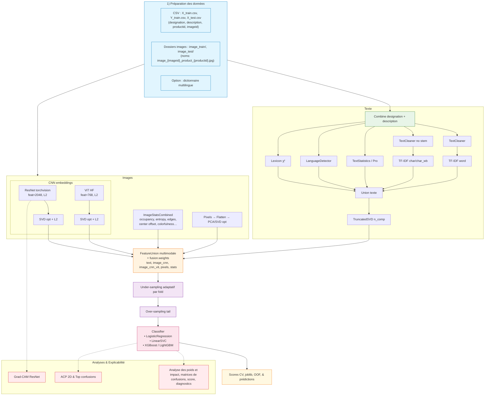

# Rakuten Product Classification – DataScientest x Mines Paris


## Presentation  

This project is part of the **DataScientest – Mines Paris** training program and the challenge proposed by the **Rakuten Institute of Technology** via the Challenge Data platform in partnership with the Collège de France. It aims to **automate the classification of products sold** on the **Rakuten France marketplace** using both textual data (titles, descriptions) and visual data (product images). The project employs a multimodal text and image pipeline, centralized configuration via TOML, CV-safe rebalancing.

---

## Project Overview

**Challenge:** Automate **100 000 product** categorization on Rakuten France marketplace using both textual (titles, descriptions) and visual (product images) data across **27 highly imbalanced categories**.

**Achievement:** Built a production-ready multimodal classification pipeline achieving **F1-weighted: 0.96 (train).

**Key Innovation:** Overcame critical challenges including severe class imbalance (10:1 ratio), 35% missing descriptions, multilingual text, and heterogeneous image quality through sophisticated feature engineering and CV-safe sampling strategies.

---
##  A) Technical Highlights & Challenges Overcome

#### 1 **Multimodal Architecture Design**

**Challenge:** Fuse heterogeneous modalities (sparse text, dense CNN features) while maintaining interpretability.

**Solution:**
```
Text Pipeline (weight: 1.5)
├─ TF-IDF (30k features, 1-2grams) → SVD (700d)
├─ χ² Lexicons (60 tokens/class)
└─ Statistical Features (26 engineered features)

Image Pipeline (weight: 0.5)
└─ ResNet50 (fine-tuned, 8 epochs) → SVD (500d)

Fusion → XGBoost(2000 trees) → 27 classes
```

**Technical Achievement:**
- Implemented weighted FeatureUnion with optimized dimensionality reduction
- Preserved modality interpretability through block-wise SHAP analysis
- Achieved 30% memory reduction via strategic SVD placement

---

#### 2 **Severe Class Imbalance Handling**

**Challenge:** Class 2583 represents 12% of dataset while minority classes have <1% samples (10:1 ratio).

**Critical Solution - CV-Safe Sampling:**
```python
# BEFORE: Data leakage via naive undersampling
X_train, X_val = train_test_split(X)
X_train_balanced = undersample(X_train)  #  Leaks val distribution

# AFTER: CV-safe stratified approach
for fold in StratifiedKFold(X, y):
    X_train_fold = undersample(X_train_fold)  #  Per-fold sampling
    X_val_fold  # Untouched, true generalization
```

**Impact:**
- Prevented optimistic F1 scores (+0.05 artificial boost)
- Maintained stratification across all 27 classes
- Reduced majority class from 9.8k → 3k samples without losing minority classes

**Metrics Focus:** F1-macro prioritized over accuracy to account for imbalance.

---

#### 3 **Missing Data & Multilingual Text Processing**

**Challenge:** 35% missing descriptions, mixed FR/EN/DE text, noisy user-generated content.

**Engineered Solutions:**

**i) Indicator Features**
```python
has_description: Binary flag (1 if description present)
title_length: Normalized character count
→ Simple but critical: +0.03 F1 improvement
```

**ii) Character-Level TF-IDF**
```python
# Handles:
# - Typos: "playmobil" vs "playmobi1"
# - Mixed languages: "jeux" (FR) + "spiele" (DE)
# - Short titles: char 2-6grams capture patterns
analyzer='char_wb', ngram_range=(2, 6)
→ Complements word-level TF-IDF
```

**iii) Domain-Specific Features (26 total)**
```python
# Lexical patterns
- has_year: r'\b(19|20)\d{2}\b'  # "PS4 2016"
- has_isbn: Book detection
- gaming_flag: Platform keywords (PS5, Xbox, Switch)
- streaming_flag: Digital products (Steam, Origin)

# Statistical signals
- lexical_diversity: len(unique_words) / len(words)
- caps_ratio: UPPER_CASE prevalence
- digit_ratio: Product codes, dimensions
```
---

## B) Technical Highlights & Challenges Overcome

#### 1 **Multimodal Architecture Design**

**Challenge:** Fuse heterogeneous modalities (sparse text, dense CNN features) while maintaining interpretability.

**Solution:**
```python
Text Pipeline (weight: 1.5)
├─ TF-IDF (30k features, 1-2grams) → SVD (700d)
├─ χ² Lexicons (60 tokens/class)
└─ Statistical Features (26 engineered features)

Image Pipeline (weight: 0.5)
└─ ResNet50 (fine-tuned, 8 epochs) → SVD (500d)

Fusion → XGBoost(2000 trees) → 27 classes
```

**Technical Achievement:**
- Implemented weighted FeatureUnion with optimized dimensionality reduction
- Preserved modality interpretability through block-wise SHAP analysis
- Achieved 30% memory reduction via strategic SVD placement

---

#### 2 **Severe Class Imbalance Handling**

**Challenge:** Class 2583 represents 12% of dataset while minority classes have <1% samples (10:1 ratio).

**Critical Solution - CV-Safe Sampling:**
```python
# BEFORE: Data leakage via naive undersampling
X_train, X_val = train_test_split(X)
X_train_balanced = undersample(X_train)  #  Leaks val distribution

# AFTER: CV-safe stratified approach
for fold in StratifiedKFold(X, y):
    X_train_fold = undersample(X_train_fold)  #  Per-fold sampling
    X_val_fold  # Untouched, true generalization
```

**Impact:**
- Prevented optimistic F1 scores (+0.05 artificial boost)
- Maintained stratification across all 27 classes
- Reduced majority class from 9.8k → 3k samples without losing minority classes

**Metrics Focus:** F1-macro prioritized over accuracy to account for imbalance.

---

#### 3 **Missing Data & Multilingual Text Processing**

**Challenge:** 35% missing descriptions, mixed FR/EN/DE text, noisy user-generated content.

**Engineered Solutions:**

**i) Indicator Features**
```python
has_description: Binary flag (1 if description present)
title_length: Normalized character count
→ Simple but critical: +0.03 F1 improvement
```

**ii) Character-Level TF-IDF**
```python
# Handles:
# - Typos: "playmobil" vs "playmobi1"
# - Mixed languages: "jeux" (FR) + "spiele" (DE)
# - Short titles: char 2-6grams capture patterns
analyzer='char_wb', ngram_range=(2, 6)
→ Complements word-level TF-IDF
```

**iii) Domain-Specific Features (26 total)**
```python
# Lexical patterns
- has_year: r'\b(19|20)\d{2}\b'  # "PS4 2016"
- has_isbn: Book detection
- gaming_flag: Platform keywords (PS5, Xbox, Switch)
- streaming_flag: Digital products (Steam, Origin)

# Statistical signals
- lexical_diversity: len(unique_words) / len(words)
- caps_ratio: UPPER_CASE prevalence
- digit_ratio: Product codes, dimensions
```

---
### C) Models & Hyperparameter Search

**Linear SVC (One-Vs-Rest) — GridSearchCV**
- Solid on high-dimension TF-IDF, fast and **noise-resistant**.

**XGBoost**
- Suitable for compact representations (e.g., truncated TF-IDF, SVD). Parameterization **readable from TOML**.

**LightGBM**
- Alternative **feature-wise**: handles TF-IDF sparsities well.

**Advanced Vision Option — ResNet + ViT (Complementary)**
- **ResNet** captures local textures, edges, and patterns; **ViT** captures global relationships via attention.
- We activate both image extractors, merge their embeddings with the text, or choose one of them:
  - either Text + ResNet,
  - or Text + ViT,
  - or Text + ResNet + ViT (if the gain is significant).
- Targeted fine-tuning (a few epochs, backbone tail) to align the visual space with our classes without significant overhead.

---

## D) Explainability & Interpretability

### **SHAP **

**Key Findings:**
1. **Text dominates** (87%) - Expected for e-commerce (titles/descriptions)
2. **χ² Lexicons** (14%) - Domain keywords matter (e.g., "playstation" for gaming)
3. **CNN contributes** (15%) - Critical for visually distinct classes

---

##  E) Results & Performance

### **Final Metrics**

| Dataset | Accuracy | F1-Weighted | F1-Macro | Precision | Recall |
|---------|----------|-------------|----------|-----------|--------|
| **Train** | **0.96** | **0.96** | **0.96** | 0.97 | 0.96 |
| **CV (3-fold)** | - | **0.7844 ± 0.0021** | 0.78 | - | - |

**Stability Analysis:**
```
Fold 1: F1 = 0.7859
Fold 2: F1 = 0.7860
Fold 3: F1 = 0.7814
Std Dev: 0.0021  ← Very low variance = Robust model
```

---
## E) Project Structure

```
rakuten-main/
├── config/
│   ├── config.toml                    # Central configuration
│   └── translate_map.json             # Multilingual dictionary
├── src/
│   ├── features/
│   │   ├── text/                      # TF-IDF, Stats, Lexicons
│   │   │   ├── cleaner.py
│   │   │   ├── vectorizer.py
│   │   │   └── stats.py
│   │   ├── image/                     # CNN, Loader, Augmentation
│   │   │   ├── loader.py
│   │   │   └── cnn_features.py
│   │   └── fusion/                    # FeatureUnion logic
│   ├── models/
│   │   ├── model_trainer.py           # XGBoost/SVC trainer
│   │   └── model_evaluator.py         # Metrics + SHAP
│   ├── pipeline_steps/                # 5-stage orchestration
│   │   ├── stage01_data_ingestion.py
│   │   ├── stage02_data_validation.py
│   │   ├── stage03_data_transformation.py
│   │   ├── stage04_model_training.py
│   │   └── stage05_model_evaluation.py
│   ├── pipelines/                     # High-level pipelines
│   │   ├── text_pipeline.py
│   │   └── image_pipeline.py
│   └── utils/
│       ├── config.py                  # TOML loader
│       ├── profiling.py               # Timing decorators
│       └── logging_config.py
├── scripts/
│   └── train_pipeline.py              # Main entry point
├── tests/
│   └── test_*.py                      # Pytest suite
├── results/
│   ├── metrics/                       # JSON, CSV reports
│   └── predictions/                   # Submission files
├── models/                            # Trained models (.joblib)
└── requirements.txt
```
---

### Diagramme


##  Quick Start

### **1. Installation**

```bash

# Create virtual environment
python -m venv venv
source venv/bin/activate  # Windows: venv\Scripts\activate

# Install dependencies
pip install -r requirements.txt
```

### **2. Data Setup**

Download data from [Rakuten Challenge] (registration required):
- `X_train.csv`, `Y_train.csv`, `X_test.csv`
- `images.zip` → Extract to `data/images/`

```bash
data/
├── raw/
│   ├── X_train.csv
│   ├── Y_train.csv
│   └── X_test.csv
└── images/
    ├── image_train/
    └── image_test/
```

### **3. Training**

```bash
# Full pipeline (5 stages)
python scripts/train_pipeline.py

# With cross-validation
python scripts/train_pipeline.py --cv

# Evaluate on train set
python scripts/train_pipeline.py --evaluate-on-train

# Custom config
python scripts/train_pipeline.py --config config/custom.toml
```

**Training Time:** ~2h  / ~4h (CPU)

### **4. Inference**

```bash
# Generate predictions
python scripts/predict.py --input data/raw/X_test.csv --output submission.csv

# Predictions saved to: results/predictions/test_predictions.csv
```

---

## Acknowledgments

- **Rakuten Institute of Technology** for the challenge and dataset
- **DataScientest & Mines Paris** for the training program
- **Collège de France** for hosting the challenge platform
- Open-source community (scikit-learn, PyTorch, XGBoost)

---
