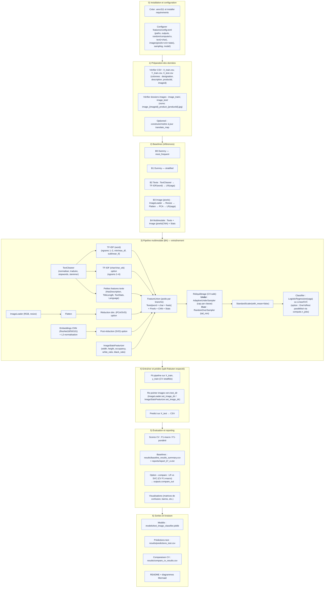

# Rakuten Product Classification – DataScientest x Mines Paris


## Presentation  


Ce projet s’inscrit dans le cadre de la formation **DataScientest – Mines Paris** et du challenge proposé par **Rakuten Institute of Technology** via la plateforme Challenge Data en partenariat avec le **Collège de France**. Il vise à **automatiser la classification des produits vendus sur la marketplace Rakuten** France en s’appuyant à la fois sur des **données textuelles** (titres, descriptions) et **visuelles** (images produits).
Pipeline multimodale texte + image, **configuration centralisée via TOML**, rééquilibrage CV‑safe, et comparaison LR vs LinearSVC.


## Objectifs

- Construire un modèle de classification supervisée multimodal (texte + image) pour prédire la catégorie prdtypecode des produits.

- Traiter les défis liés au déséquilibre des classes, à la diversité linguistique et à l’hétérogénéité des visuels.

- Proposer une structuration sémantique des catégories pour faciliter l'expérience utilisateur et optimiser la navigation.

-L’approche est multimodale : une branche texte (nettoyage + TF-IDF) et une branche image (chargement, normalisation, PCA), fusionnées puis apprises par un classifieur linéaire, avec rééquilibrage des classes (undersampling/oversampling).

## Méthodologie — Planning Modélisation & Livrables (MÀJ)

Contexte Rendu 1 (EDA) acquis : 
**27 classes fortement déséquilibrées**, ~**35 %** de `description` manquante, données **multilingues**, images **500×500** nommées `image_{imageid}_product_{productid}.jpg`. 

Priorités : pipeline **multimodale** (Texte+Image), **sampling CV-safe**, métriques **F1 macro / pondéré**.

- **Tableaux / Figures** :
- Histogramme des **fréquences par classe** (trié).
- Boxplots des **longueurs** `designation_len` / `description_len`.  
- **Top n-grammes** avant/après nettoyage (word & char).  
- Histos `occupancy`, `white_ratio`, `black_ratio` (train global + par classe *si lisible*).
- **Constats clés** :
- Fort **déséquilibre** → métriques macro + **sampling CV-safe** indispensables.
- **35%** de descriptions manquantes → **`has_description`** aide ; **char** compense titres courts.
- **Images** : stats simples + **CNN** améliorent la robustesse vs pixels seuls.
---

### Modélisation  

#### Étape 1 — Baselines & premier cadrage 
- Lancer **B0–B3** puis un premier **B4** minimal (Texte=TF-IDF(word), Image=pixels+PCA, **sans** char/CNN).
- Générer : `results/baseline_results_summary.csv`, `reports/report_b*_cv.txt`.
- Analyser la pertinence : déséquilibre vs F1-macro, classes confondues (matrices de confusion top-K).

#### Étape 2 — Mesures & optimisation 
- **Mesures** : F1-macro & F1-pondéré + confusion (B2 & B4).
- **Optimisations rapides** :
  - Texte : activer **TF-IDF(char/char_wb)**, ajuster `max_features`, `min_df/max_df`, pondérations `FeatureUnion`.
  - Image (pixels) : ajuster `size` (32/64) & **PCA** (`n_components` 80–120).
  - **Sampling CV-safe** : `AdaptiveUnderSampler` (cap p85–p90) → `RandomOverSampler` (tail_min 1 000–1 500).
  - **Comparaison modèle** : `--compare` (**LR(saga)** vs **LinearSVC**), tuning `C`.
  - **CNN (option)** : embeddings **ResNet18/50** + **SVD 128–256**.
- Livrables : `results/compare_cv_results.csv`, figures barres & confusion mises à jour, notes d’ablation.

#### Étape 3 — Modélisation avancée & interprétabilité 
- **Bagging/Boosting** *(si temps/ressources)* : LightGBM/HistGBDT sur **text SVD** (+ image SVD) en One-Vs-Rest.
- **Deep Learning** *(option GPU)* : baseline **CNN embeddings** renforcée (pooling/MLP), ou petit **ViT/EfficientNet** gelé + head linéaire.
- **Interprétabilité** :
  - Texte : coefficients LR/SVC par classe, **permutation importance**, **LIME/SHAP** sur classes clés.
  - Image : inspection d’**erreurs typiques** (collages d’images + confusion).
- **Conclusions métiers** : synthèse succès/limites, recommandations (qualité de saisie, regroupements de classes).
- Livrable : **Rendu 2 — rapport de modélisation** (résultats, ablations, interprétations, recommandations).

---

#### Étape 4 — Rapport final + codes GitHub  
- Fusionner **Rendu 1 + Rendu 2** → rapport final avec **conclusion & ouverture**.
- Code **propre & commenté** : README (pipelines, toggles TOML, diagrammes Mermaid), dossiers `results/` & `reports/` structurés.

---

#### Étape 5 — Streamlit + Soutenances  
- App **esthétique** (plusieurs onglets) : *Aperçu données*, *Training & scores*, *Démo prédiction*.
- **Pas de ré-entraînement** côté app ; charger `models/text_image_classifier.joblib`.
- **Soutenance** : 20 min présentation + 10 min Q/R ; au choix **Slides + Démo** ou **App seule**.
- Checklist : stabilité (pas de bugs), temps d’inférence ok, dépendances légères.

---

### Checkpoints & To-Do rapides
- Finaliser Step 1 (B0–B4 minimal) & publier `baseline_results_summary.csv`.
- Activer char, sampling CV-safe & `--compare` (Step 2) ; produire `compare_cv_results.csv`.
- Lancer CNN+SVD (option) et ablations clés (char on/off, stats image on/off, pixels vs CNN).
- Rédiger **Rendu 2** (graphes, confusions, interprétations) → avant **26/09**.
- Finaliser rapport & repo GitHub **avant 03/10** ; préparer **Streamlit** & pitch.

### Diagramme



### Feature Engineering

#### A — Traitement du texte – Pipeline Rakuten

##### 1) Objectif
Exploiter le texte produit (**designation** + **description**) pour **prédire la catégorie** :
- **Nettoyer** les chaînes (retirer le bruit, harmoniser).
- **Représenter** en TF-IDF **word** et, en option, **char/char_wb** (robuste aux fautes de frappe & variantes).
- **Enrichir** avec des signaux simples (ex. présence d’une description, longueur du titre, stats de texte).
- **Fusionner & pondérer** les sous-branches via `FeatureUnion`.

##### 2) Sources utilisées
- **designation** : nom du produit  
- **description** : texte descriptif  
- *(optionnel)* `translate_map` : normalisation inter-langues (EN/DE/ES → FR)

> **Remarque** : l’existence d’une description est informative → feature binaire `has_description`.

##### 3) Étapes de traitement

###### 3.1) Fusion & indicateur `has_description`
- **Fusionner** `designation` et `description` (ou passer les deux colonnes au vectoriseur qui les concatène en interne).
- **Ajouter** `has_description = 1` si `description` non vide, sinon `0`.  
→ **Maximiser** l’information lexicale + **capturer** un signal de complétude.

###### 3.2) Nettoyage avec `TextCleaner`
- **Retirer** le HTML (balises `<...>`, entités `&amp;`, `&#39;`, …).
- **Normaliser** : minuscules, accents (`strip_accents='unicode'`), ponctuation, caractères non alphanumériques.
- **Stopwords** FR (NLTK) — penser à `nltk.download('stopwords')`.
- **Traduire/mapper** via `translate_map` si fourni (anglicismes → FR, homogénéisation marques).
- **Stemming** (Snowball FR) pour réduire la variance morphologique.

###### 3.3) Vectorisation TF-IDF (branche **word**)
- **`max_features`** : taille du vocabulaire (ex. **100_000** en prod).
- **`ngram_range`** : `(1, 2)` typiquement → 1-gram (*chaussure*), 2-gram (*acier inox*, *coque iphone*).
- **`min_df` / `max_df`** : filtrer les termes **trop rares** / **trop fréquents** (ex. `2` / `0.95`).
- **`sublinear_tf = true`** : `1 + log(tf)` pour **réduire l’impact** des répétitions.
- **`norm = 'l2'`** : nécessaire pour bons perfs des modèles linéaires.
- **`strip_accents = 'unicode'`** ; **`lowercase = false`** (déjà géré par `TextCleaner`).
- **`dtype = float64`** : éviter les conversions/avertissements sklearn.

###### 3.4) Vectorisation TF-IDF (branche **char/char_wb** — optionnelle)
- **`analyzer = "char_wb"`** recommandé (captures n-grammes **à l’intérieur** des mots, plus robuste).
- **`ngram_range = (2, 6)`** : capte affixes, marques, fautes de frappe, formats (e.g. *128go*).
- **`min_df` / `max_df`** : mêmes principes que la branche word.
- Apporte un **gain robuste** sur titres courts, langues mixtes ou bruitées.

###### 3.5) Statistiques liées au texte
- **`HasDescriptionFlag`** : binaire 0/1 sur la complétude.
- **`DesignationLength`** : longueur/compte de tokens du titre (signal de qualité de saisie).
- **`TextStatistics`** : ratios chiffres/majuscules/ponctuation, densité moyenne de tokens, etc.
- **`LanguageDetector`** : FR/EN/… (utile pour pondérer le stemming/stopwords ou pour l’analyse). Attention c'est option est couteuse et peut être désactivée depuis tomlib, il faut
aussi penser à enlever sont poid dans la ponderation dans tomlib également.

###### 3.6) Fusion & pondération (`FeatureUnion`)
- Fusion des sous-branches : **TF-IDF (word)**, **TF-IDF (char)**, **has_desc**, **title_len**, **text_stats**, **language**.
- **Pondération** possible (ex. `tfidf_word=1.0`, `tfidf_char=0.5`, `has_desc=0.2`, `title_len=0.2`, `text_stats=0.2`, `language=0.1`).
- Sortie **creuse CSR** compatible avec l’image et la suite du pipeline.

###### 3.7) Sortie & intégration modèle
- La branche texte renvoie une **matrice creuse float64 L2-normée**, prête pour la **fusion multimodale**.
- Si un **scaler** est appliqué plus loin, utiliser `StandardScaler(with_mean=False)` pour préserver le format creux.


**Exemple TOML — section `[text]`**
```toml
[text]
# Active/désactive les features additionnelles
use_text_stats = true
use_language_detection = true

# Branche caractères (optionnelle)
[text.char]
enabled = true
ngram_min = 2
ngram_max = 6

# Pondération des sous-branches (FeatureUnion)
[text.weights]
tfidf_word = 1.0
tfidf_char = 0.5         # pris en compte si [text.char.enabled]=true
has_desc   = 0.2
title_len  = 0.2
text_stats = 0.2         # pris en compte si use_text_stats=true
language   = 0.1         # pris en compte si use_language_detection=true
```

#### B — Traitement image – Pipeline Rakuten

##### 1) Objectif
Représenter l’information visuelle sous forme de **vecteurs** utilisables par des modèles linéaires, via deux branches **alternatives** (activables par la config) :
- **Pixels** : chargement → redimensionnement → flatten → *(option)* réduction (PCA).
- **CNN** : extraction d’**embeddings ResNet** → **L2-normalisation** → *(option)* réduction (SVD).

---

##### 2) Étapes

###### 2.1) Branche Pixels**
- **Charger** via `ImageLoader` (pattern : `image_{imageid}_product_{productid}.jpg`).
- **Convertir** en **RGB** et **redimensionner** à `images.size` (TOML).
- **Aplatir** (flatten) pour obtenir un vecteur de pixels (dense).
- **Gérer** les images manquantes → **vecteur nul** (image noire) pour ne pas casser la pipeline.
- **(Option)** **réduire** la dimension (PCA) — voir section **C**.

###### 2.2) Branche CNN (optionnelle)**
- **Charger & prétraiter** l’image (RGB, resize).
- **Extraire** un embedding via **ResNet** (`resnet18`=512d, `resnet50/101`=2048d) **sans** fine-tuning.
- **Normaliser L2** l’embedding (robuste aux variations d’échelle/éclairage).
- **(Option)** **réduire** la dimension (SVD aléatoire) pour accélérer la CV et limiter la mémoire.
- **Fallback** images manquantes → **vecteur 0** (même dimension que l’embedding).

> **Note** : La baseline *B3* utilise la branche **Pixels** par défaut ; si `[images.cnn.enabled]=true`, la branche **CNN** est utilisée pour l’image.

---

##### 3) Exemple TOML — sections `[images]` & `[images.cnn]`

```toml
[images]
train_dir = "data/images/images/image_train"
test_dir  = "data/images/images/image_test"
size = [64, 64]

[images.dim_reduction]
enabled = true
method = "pca"      # "pca" conseillé pour pixels denses
n_components = 100
random_state = 42

[images.cnn]
enabled = true
arch = "resnet50"          # "resnet18" (512d) | "resnet50"/"resnet101" (2048d)
batch_size = 16
device = "auto"            # "auto" | "cpu" | "cuda"
use_imagenet_norm = true
fallback_zero = true       # image manquante -> vecteur 0
dtype = "float32"

[images.cnn.dim_reduction]
enabled = true
n_components = 256         # post-réduction (SVD) des embeddings
random_state = 42

```

#### C — Réduction de dimension (PCA / SVD)

##### 1) Objectif
Réduire la dimension des vecteurs d’images pour :
- **accélérer** l’entraînement et la validation croisée (CV),
- **limiter** l’usage mémoire,
- **stabiliser** le modèle (moins de bruit),
tout en **conservant l’essentiel** de l’information visuelle.

##### 2) Quand et pourquoi
- **Pixels (flatten)** → données **denses** : privilégier **PCA** (centrée) pour capturer la variance dominante.
- **Embeddings CNN (L2)** → vecteurs **denses** déjà bien conditionnés : **TruncatedSVD** (aléatoire) est souvent plus rapide et **non centrant** (n’altère pas la normalisation L2).
- Activer la réduction surtout quand `images.size` augmente (ex. **64×64**, **96×96**…) ou que `arch` produit des embeddings longs (**2048d** pour ResNet50/101).

##### 3) Méthodes
- **PCA** : décomposition sur données **denses** (pixels).
- **TruncatedSVD** : bonne réduction **sans centrage** (embeddings CNN, matrices creuses texte).

##### 4) Paramétrage TOML
```toml
[images]
size = [64, 64]                   # 32×32 en dev ; 64×64 en prod

[images.dim_reduction]
enabled = true                    # branche Pixels
method = "pca"                    # "pca" (pixels) | "svd" (si besoin)
n_components = 100
random_state = 42

[images.cnn.dim_reduction]
enabled = true                    # branche CNN
n_components = 256                # 128–512 selon budget
random_state = 42
```

##### 5) Exemple côté code (pipeline images)**

###### Dans train_model.py (extrait)
from models.image_pipeline import create_image_pipeline
####### Pixels (B3 par défaut)
image_pixels = create_image_pipeline(
    image_dir=cfg["images"]["train_dir"],
    image_size=tuple(cfg["images"]["size"]),
    dim_reduction=cfg.get("images", {}).get("dim_reduction", {})
)

####### CNN (activé si cfg["images"]["cnn"]["enabled"] == True)
from models.cnn_features import create_cnn_branch_from_cfg
image_cnn = create_cnn_branch_from_cfg(cfg["images"]["cnn"])

##### 6) Conseils performance / mémoire
- **Dev rapide (Pixels)** : `size = [32, 32]` + `n_components = 50–80`.
- **Prod (Pixels)** : `size = [64, 64]` + `n_components = 80–120`.
- **CNN** : `resnet18` si RAM/GPU limités, `resnet50` pour un meilleur signal ; **post-SVD 128–256** recommandé.
- **Batch_size / device** : adapter `batch_size` selon la VRAM/CPU ; `device="auto"` choisit le GPU s’il est disponible.
- **Standardiser après sampling** (pipeline globale) pour scaler ce que voit réellement le modèle.

##### 7) Contrôles rapides
- **Forme des features** : vérifier que la dimension baisse quand la réduction est activée.
- **Seeds** : fixer `random_state` (PCA/SVD) pour des runs reproductibles.
- **Overfit** : un `n_components` trop grand peut réintroduire du bruit → suivre la **F1-macro CV**.

---

#### D — Features statistiques d’image (objet vs fond)

##### 1) Objectif
Capturer des **indices globaux** (taille, occupation, contraste) complémentaires aux pixels/embeddings. Peu coûteux et souvent **robustes**.

##### 2) Principe
- **Seuils gris** 0–255 :
  - **Noir** ≤ `black_threshold` (ex. 25)
  - **Blanc** ≥ `white_threshold` (ex. 230)
  - **Objet** = le **reste** (pixels intermédiaires)
- **Filtrer** les petites composantes (`min_area`) pour éviter le bruit.
- **Mesurer** sur l’objet principal :
  - `width`, `height` → dimensions de l’enveloppe
  - `occupancy` → ratio surface_objet / surface_image ∈ [0, 1]
- **Contraste global** :
  - `white_ratio` → proportion de pixels « blancs »
  - `black_ratio` → proportion de pixels « noirs »

> `occupancy = nb_pixels_objet / (H × W)`

##### 3) Paramétrage via TOML
```toml
[images.stats]
enabled = true          # activer la branche stats
white_threshold = 230   # seuil "blanc" (fond clair)
black_threshold = 25    # seuil "noir"
min_area = 16           # ignorer les composantes trop petites
out_prefix = "auto"     # colonnes nommées avec les seuils (ex. img_w230_b25_*)
```

##### 4) Intégration dans la pipeline

- **Ajouter** la branche `ImageStatsFeaturizer` dans le **FeatureUnion** aux côtés de la **branche texte** et de **la branche image** (**pixels** *ou* **CNN** selon la config).
- **Réordonner** correctement la suite du flow : **fusion → under-sampling adaptatif → over-sampling → standardisation → classifieur**.
- **Re-pointer** les répertoires d’images **avant la prédiction** :
  - `ImageLoader.set_image_dir(<test_dir>)`
  - `ImageStatsFeaturizer.set_image_dir(<test_dir>)`
  - *(si CNN activé)* : branche CNN → même répertoire test.
- **Pondérer** les branches dans `FeatureUnion` si besoin (`texte`, `pixels`/`cnn`, `stats`) pour équilibrer leur contribution.

---

##### 5) Bonnes pratiques

- **Seuils** : `white_threshold=230` / `black_threshold=25` conviennent aux fonds clairs ;  
  baisser `white_threshold` si fonds sombres, monter `black_threshold` si fond gris.
- **Diagnostiquer** : inspecter la distribution de `occupancy`, `white_ratio`, `black_ratio` (histos/boxplots) sur un échantillon.
- **Corréler** aux classes pour repérer les signaux utiles (ex. *livres* vs *high-tech*).
- **Ablations** : couper rapidement la branche via `[images.stats].enabled = false` pour mesurer son impact.
- **Traçabilité** : laisser `out_prefix="auto"` afin d’encoder les seuils dans les noms de colonnes.
- **Sanity-checks** : vérifier l’absence de `NaN`/`Inf` après les stats ; confirmer l’alignement `productid/imageid`.

---

#### E — Approche multimodale : fusion & sampling

##### 1) Objectif
Combiner **Texte** + **Image** (**Pixels** *ou* **CNN**) + **Stats d’image** dans une **même pipeline**, puis **rééquilibrer** les classes de façon **CV-safe**, **standardiser** et **entraîner** un classifieur linéaire robuste (**LogisticRegression(saga)** ou **LinearSVC**).

---

##### 2) Flow d’entraînement (résumé)

1. **Texte** : `TextCleaner` → `TF-IDF (word)` **+ (option)** `TF-IDF (char/char_wb)` → petites features (`HasDescriptionFlag`, `DesignationLength`, *(option)* `TextStatistics`, `LanguageDetector`).
2. **Image (pixels)** : `ImageLoader` → `Resize` → `Flatten` → **(option)** réduction **PCA**.  
   **OU (CNN)** : `ResNet18/50/101` → **L2-norm** → **(option)** réduction **SVD**.
3. **Stats image** : `ImageStatsFeaturizer` (ex. `width`, `height`, `occupancy`, `white_ratio`, `black_ratio`).
4. **Fusion** via `FeatureUnion` (**texte** + **pixels/CNN** + **stats**) avec **poids** configurables par branche.
5. **Sampling (CV-safe)** :
   - **Under** : `AdaptiveUnderSampler` (cap par classe **recalculé à chaque fold**).
   - **Over**  : `RandomOverSampler` (remonter les classes sous `tail_min`).
6. **Scaler** : `StandardScaler(with_mean=false)` **après** sampling.
7. **Classifier** : `LogisticRegression(saga)` **ou** `LinearSVC`.  
   - Option **OvR** : `OneVsRest` parallélisé via `[compute].n_jobs`.

> **Éviter** de combiner `class_weight="balanced"` **et** les samplers (double compensation).

##### 3) Bonnes pratiques & garde-fous

- **Sampler vs `class_weight`** : choisir **l’un ou l’autre**, éviter de cumuler (double compensation).
- **CV-safe** : utiliser l’**under adaptatif** (cap recalculé **à chaque fold**) pour éviter les `ValueError` d’imblearn et toute fuite d’information.
- **Ordre des steps** : `features → under → over → scaler → model`.
- **OvR** : utile si beaucoup de classes (long tail) ; paralléliser via `[compute].n_jobs`.
- **Temps / RAM (réduire le coût)** :
  - `text.max_features`, `text.char.enabled` (désactiver ou baisser `ngram_max`), ajuster `text.weights`.
  - `images.size` (32→64), `images.dim_reduction.n_components` (PCA pixels).
  - `images.cnn.enabled` (désactiver si besoin), `images.cnn.dim_reduction.n_components` (SVD embeddings 128–256).
  - `images.cnn.batch_size` et `device` (`"auto"` bascule sur GPU si dispo).
- **Reproductibilité** : fixer `[random].seed`, `[cv].random_state` (et garder les `random_state` des réducteurs PCA/SVD).


##### 4) Contrôles rapides

- **Sanity check sampling** : logger les **effectifs par classe** avant / après under & over sur un fold.
- **Forme des features** : vérifier la dimension de `FeatureUnion` (un `fit_transform` sur mini-batch).
- **Ablations** : comparer `text.char.enabled=false/true`, `images.cnn.enabled=false/true`, `images.stats.enabled=false/true`, `ovr=false/true`, `svc` vs `lr`.
- **I/O images** : taux d’images manquantes (fallback vecteur 0), cohérence `imageid/productid`.
- **Pas de fuite** : sampling **à l’intérieur** du CV, **après** fusion des features ; aucun accès au test en entraînement.

#### F — Architecture du projet

Architecture du projet


- ├── data/
- │ ├── X_train_update.csv
- │ ├── Y_train_CVw08PX.csv
- │ └── X_test_update.csv
- │
- ├── data/images/images/
- │ ├── image_train/ # images d'entraînement
- │ └── image_test/ # images de test
- │
- ├── features/
- │ ├── config.toml # configuration centrale (texte, images, sampling, model, cv…)
- │ └── make_cleaned_frequencies_and_map.py
- │
- ├── models/ # transformeurs & pipelines
- │ ├── text_cleaner.py
- │ ├── text_vectorizer.py
- │ ├── text_features.py # HasDescription, DesignationLength, TextStatistics, LanguageDetector
- │ ├── text_pipeline.py
- │ ├── image_loader.py
- │ ├── image_stats.py # ImageStatsFeaturizer
- │ ├── image_pipeline.py # pixels → flatten → (PCA)
- │ └── cnn_features.py # embeddings ResNet → L2 → (SVD)
- │
- ├── main/
- │ └── train_model.py # orchestration (baselines, CV, pipeline complet, compare)
- │
- ├── results/
- │ ├── baseline_results_summary.csv
- │ ├── compare_cv_results.csv
- │ ├── predictions_test.csv
- │ └── figures/
- │ ├── baseline_f1_macro.png
- │ └── confusion_matrix_b4.png
- │
- ├── reports/
- │ └── report_b*_cv.txt
- │
- ├── tools/ # scripts de reporting
- │ ├── plot_baselines.py
- │ ├── plot_baseline_bars.py
- │ ├── plot_confusion_matrix.py
- │ ├── generate_requirements.py # génère un requirements.txt depuis l’environnement courant
- │ └── compare_models.py # comparaisons & visus globales
- └── README.md


#### G — Baselines & Protocole d’évaluation

Nous évaluons 5 références avant / après le multimodal :

| Code | Baseline            | Description |
|------|---------------------|-------------|
| B0   | Naïf (majoritaire) | `DummyClassifier(strategy="most_frequent")` |
| B1   | Naïf (stratifié)   | `DummyClassifier(strategy="stratified")` |
| B2   | **Texte seul**     | `TextCleaner` + `TF-IDF (word [+ char])` → **LR(saga)** |
| B3   | **Image seule**    | **Pixels** `ImageLoader→flatten→PCA` → **LR** *(ou **CNN** si `[images.cnn.enabled]=true`)* |
| B4   | **Multimodal**     | Texte + Image (Pixels **ou** CNN) + `ImageStats` + under/over (pipeline principal, **LR/SVC**) |

- **Métriques** : **F1 macro** (équité inter-classes) & **F1 pondéré**.  
- **Validation** : K-fold **stratifié** (paramétré via TOML).  
- **Reproductibilité** : `random_state` fixés ; **config centralisée**.


flowchart 
  B0[**B0** Dummy most_frequent] --> COMP[Comparaison F1]
  B1[**B1** Dummy stratified]   --> COMP
  B2[**B2** Texte seul: TF-IDF -->LR] --> COMP
  B3[**B3** Image seule: Pixels/CNN-->(PCA/SVD)-->LR] --> COMP 
  B4[**B4** Multimodal: Texte+Image+Stats+Sampling-->LR/SVC] --> COMP


#### H — Comment exécuter le projet

##### Génération du dictionnaire et des fréquences (optionnel si déjà fait)
        python features/make_cleaned_frequencies_and_map.py \
        --x_train_csv data/X_train_update.csv \
        --out_freq features/token_frequencies_cleaned_stem.csv \
        --out_map  features/translate_map_starter_from_cleaned.json \
        --config   features/config.toml


##### Lancer les baselines

###### B0 / B1
python -m main.train_model --config features/config.toml --baseline b0

python -m main.train_model --config features/config.toml --baseline b1

###### B2 (texte seul)
python -m main.train_model --config features/config.toml --baseline b2

###### B3 (image seule)
**Pixels par défaut ; activer CNN via [images.cnn.enabled]=true**
python -m main.train_model --config features/config.toml --baseline b3

##### Lancer le modèle multimodal (B4)
python -m main.train_model --config features/config.toml
** Sorties :**
** - Modèle sérialisé : models/text_image_classifier.joblib**
**- Prédictions test : results/predictions_test.csv**

##### (Option) Comparer LR vs SVC (CV)
python -m main.train_model --config features/config.toml --compare

→ Résultats CSV : results/compare_cv_results.csv

##### Forcer le modèle côté CLI
python -m main.train_model --config features/config.toml --model svc   # ou: lr

Écraser [model].name à la volée.

#### I — Visualisations & Rapports

# Explication des étapes
python -m notebooks.rapport_pipeline_visualisation

# ACP + top confusions pour B2 (texte)
python -m tools.diagnostics_acp_shap --kind b2

# ACP + top confusions + SHAP pour B4 (multimodal)
python -m tools.diagnostics_acp_shap --kind b4 --model results/models/final_b4.joblib

# Limiter l'échantillon PCA (plus rapide)
python -m tools.diagnostics_acp_shap --kind b3 --max-sample 4000


> Avant d’appeler les scripts de visu, lancer au moins une fois les **baselines** et/ ou le **multimodal** pour alimenter `results/` et `reports/`.

**Comparaison intégrée (depuis train_model) : B0→B4 + figures de base**


###### Comparaison complète avec toutes les visualisations

python -m tools.compare_models --csv results/baseline_results_summary_latest.csv

###### Rapport complet
python -m tools.rapport_complet --preds results/preds_b4.csv --labels-map features/labels_map.json --theme-map features/theme_map.json


##### 1)  Barres groupées – F1 macro vs F1 pondéré

python tools/plot_baseline_bars.py
###### imposer l’ordre : B0→B4
python tools/plot_baseline_bars.py --order B0 B1 B2 B3 B4

##### 2) Matrice de confusion (top-K classes)

python -m tools.plot_confusion_from_csv --csv results/preds_b4.csv --labels-map features/labels_map.json --normalize true --topN 40 --output results/figures/confusion_b4_top40.png


##### Sorties & Organisation des résultats

###### Baselines

- `results/baseline_results_summary.csv` — cumul des runs (append)
- `reports/report_b0_cv.txt`, `reports/report_b1_cv.txt`, … — `classification_report` par baseline (CV)
- `results/figures/*.png` — bar charts & matrices de confusion (+ CSV agrégés)

**Exemples :**
- `results/figures/baseline_f1_macro.png`, `results/figures/baseline_f1_bars.png`
- `results/figures/cm_<baseline>.png`, `results/figures/cm_<baseline>_full.csv`
- `reports/report_<baseline>_cv.txt`

###### Modèle complet (B4)

- `models/text_image_classifier.joblib` — pipeline entraînée
- `results/predictions_test.csv` — prédictions sur `X_test` (si génération activée)
- `results/compare_cv_results.csv` — comparaison LR vs SVC (si `--compare` ou via `tools.compare_models`)


#### J — Bonnes pratiques & Dépannage

- ##### Tester les scripts sur des échantillons en limitant la taille du train pour un test rapide

- $env:RAKUTEN_MAX_N=2000
- python -m main.train_model --config features/config.toml --baseline b2    # exemple de script
**Supprimer le cache pour ne pas garder d'ancien problèmes**
Remove-Item -Recurse -Force "C:\Users\colle\Desktop\rakuten-logs\skcache"


- ##### Fixer les seeds ([random].seed) et le parallélisme ([compute].n_jobs).
- ##### Import models introuvable : 
lancer depuis la racine avec python -m main.train_model ... et vérifier les __init__.py.
- ##### Ajustement test images sans recréer la branche : 
On met à jour le chemin du ImageLoader dans la pipeline fit (pas de recréation) → dimension identique train/test.
- ##### Convergence LR : 
augmenter max_iter (ex. 5000) ou relâcher tol.
- ##### Mémoire images :
Éviter SVD sparse sur pixels denses,
Préférer PCA dense,
Réduire images.size si nécessaire.
Pour les images : size=32 (dev) → 64 (prod) ; n_components=80–120.
- ##### Équilibrage : 
Toujours comparer B4 à B2 pour mesurer l’apport de l’image.
- ##### ValueError (undersampling > effectif fold) : under adaptatif déjà en place (CV‑safe).
- ##### **Avertissement TF‑IDF dtype** : vectorizer en float64 → pas d’alerte.
- ##### **Stopwords NLTK manquants**: nltk.download('stopwords').
- ##### **Images manquantes** : ImageLoader renvoie une image noire (0) → vérifier les chemins.
- ##### **OvR très lent** : baisser text.max_features/images.dim_reduction.n_components,
augmenter compute.n_jobs, réduire cv.splits en test.

#### K — Changelog (Rendu 2)

- Ajout des baselines B0–B3 + comparaison B4 (multimodal).
- Export automatique CSV + TXT + figures (barres, matrice de confusion).
- Refactor prédiction images : repointage du ImageLoader test sans recréer la branche (stabilité dimensionnelle).
- Paramétrage centralisé (TOML) et scripts de visualisation (tools/…).

## Installation

### Cloner ce dépôt :

git clone https://github.com/ghjulia01/Rakuten.git
cd jul25_bootcamp_ds_classification-de-produits-e--commerce-rakuten-main

### Créer un environnement virtuel (Windows)

python -m venv .venv311

### Activer un environnement virtuel (Windows)

#### Sous PowerShell :
.venv311\Scripts\Activate.ps1

#### Ou sous CMD :
.venv311\Scripts\activate.bat

#### (Sous Linux/Mac, utilisez `source .venv311/bin/activate`)

#### Choisir le fichier dans tomlib ou enregister le cache 
Il est important de choisir le repertoire local ou mettre les logs pour ne pas créer de latence avec la synchronisation
[outputs]
log_dir = "C:/Users/...."

### Installer les dépendances :
python -m pip install --upgrade pip setuptools wheel

#### Si requirements.txt existe déjà :
pip install -r requirements.txt

#### Sinon, générer d'abord le fichier requirements.txt avec le script fourni :
python tools/generate_requirements.py
pip install -r requirements.txt

#### Télécharger  les stopwords NLTK :
python -c "import nltk; nltk.download('stopwords')"

### Télécharger les données (fournies dans le cadre du challenge Rakuten) :

Il est obligatoire de s'enregistrer au challenge pour pouvoir accéder aux données.

- X_train.csv, Y_train.csv, X_test.csv
- images.zip à extraire dans ./data/images/


## Licence

Ce projet utilise des données propriétaires de Rakuten, mises à disposition uniquement à des fins de formation et de compétition. Toute réutilisation est interdite sans autorisation.

**Streamlit Application** (prochaines étapes)

Une application Streamlit est proposée pour visualiser les résultats :

## Presentation and Installation

Fonctionnalités qui seront disponibles :

- Visualisation d’images par catégorie
- Analyse des mots-clés par catégorie
- Nuages de mots (avec ou sans nettoyage)
- Statistiques descriptives
- Arborescence thématique des catégories


## Streamlit App

**Add explanations on how to use the app.**

To run the app (be careful with the paths of the files in the app):

```shell
conda create --name my-awesome-streamlit python=3.9
conda activate my-awesome-streamlit
pip install -r requirements.txt
streamlit run app.py
```

The app should then be available at [localhost:8501](http://localhost:8501).
