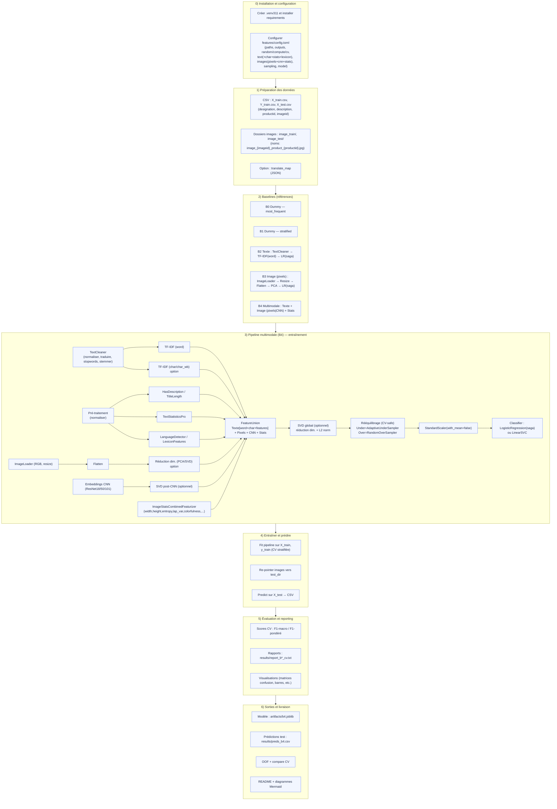

# Rakuten Product Classification – DataScientest x Mines Paris


## Presentation  


Ce projet s’inscrit dans le cadre de la formation **DataScientest – Mines Paris** et du challenge proposé par **Rakuten Institute of Technology** via la plateforme Challenge Data en partenariat avec le **Collège de France**. Il vise à **automatiser la classification des produits vendus sur la marketplace Rakuten** France en s’appuyant à la fois sur des **données textuelles** (titres, descriptions) et **visuelles** (images produits).
Pipeline multimodale texte + image, **configuration centralisée via TOML**, rééquilibrage CV‑safe, et comparaison LR vs LinearSVC.


## Objectifs

- Construire un modèle de classification supervisée multimodal (texte + image) pour prédire la catégorie prdtypecode des produits.

- Traiter les défis liés au déséquilibre des classes, à la diversité linguistique et à l’hétérogénéité des visuels.

- Proposer une structuration sémantique des catégories pour faciliter l'expérience utilisateur et optimiser la navigation.

-L’approche est multimodale : une branche texte (nettoyage + TF-IDF) et une branche image (chargement, normalisation, PCA ou  CNN), fusionnées puis apprises par un classifieur linéaire, avec rééquilibrage des classes (undersampling/oversampling).

## Méthodologie

- **Constats clés** :

- **27 classes fortement déséquilibrées** → métriques macro + **sampling CV-safe** indispensables.
- ~**35 %** de `description` manquante, données **multilingues** → **`has_description`** aide ; **char** compense titres courts.
- images **500×500** nommées `image_{imageid}_product_{productid}.jpg`. 

**Objectif**

- Construire un pipeline **Texte + Image** robuste sur un jeu **très déséquilibré**, multilingue, avec **35% de descriptions manquantes**
- Priorités : **F1-macro**, validation **CV-safe**, explicabilité (poids features et impact pour chacune des classes/ cartes Grad-CAM).
- ** Enrichir la représentation **multimodale** avec des **signaux simples, interprétables et rapides** à calculer, utiles pour la robustesse (manques de description, bruit visuel, classes proches).

---

### Pipeline (vue d’ensemble)

**Texte**
- Nettoyage (map de traduction), **TF-IDF word + char** (union).
- Gestion des champs manquants via `has_description`, pondération char pour les titres courts.

**Image**
- **CNN ResNet** (torchvision) → **embedding 2048-d** (L2-norm) ; option **ViT** (HF) → **768-d**.
- **Fine-tuning léger** (défige `layer4` pour ResNet / derniers blocs pour ViT).
- **Sauvegarde de la tête de classification** (logits) pour l’explicabilité : `artifacts/head_ft.pt`.

**Fusion**
- Somme pondérée des branches (`text`, `image_cnn`, `image_cnn_vit`…), **weights** calibrables (grid simple).
- Réduction de dimension optionnelle (SVD) côté image.

---

### Validation & métriques

- **CV stratifiée** (k-fold)
- **Métriques** : **F1-macro** (prioritaire), F1-pondéré en second.
- **Export** des diagnostics de run : **branches fusionnées**, **poids appliqués**, **CNN activée** (arch/SVD), **n train/val**, **top modèles** retenus, etc.

---

### Modèles & recherche d’hyperparamètres

**Linear SVC (One-Vs-Rest) — GridSearchCV**
- Solide sur TF-IDF haute dimension, rapide et **robuste au bruit**.

**XGBoost**
- Bon sur représentations compactes (ex. TF-IDF tronquée, SVD). Paramétrage **lisible depuis TOML**.

**LightGBM**
- Alternative **feature-wise** : gère bien les sparsités TF-IDF.

**Option Vision avancée — ResNet + ViT (complémentarité)**
- **ResNet** capte la **texture / bords / motifs locaux** ; **ViT** capte des **relations globales** via attention.
- Nous **activons les deux** extracteurs d’images, fusionnons leurs embeddings avec le texte, et laissons la **CV** choisir :
  - soit **Texte + ResNet**, 
  - soit **Texte + ViT**, 
  - soit **Texte + ResNet + ViT** (si le gain est significatif).
- **Fine-tuning ciblé** (quelques époques, queue du backbone) pour **aligner** l’espace visuel sur nos classes sans surcoût majeur.

---

### Impact des features (global & par classe)

**Modèles linéaires (Linear SVC / LR OvR)**
- **Global (macro)** : on agrège les **|coefficients|** par groupes (n-grammes mots / caractères) → vue des signaux les plus discriminants.
- **Par classe (OvR)** : pour chaque classe, on **rank** les features par poids (positif = indicateur de la classe, négatif = anti-signal).
- **Image → texte** : le **poids de branche** (`fusion.weights`) indique la **contribution relative**. En cas de classes visuellement distinctes (ex. “consoles/chaussures”), la branche image gagne du poids ; sur des classes proches sémantiquement, le texte domine.

**Vision**
- **Grad-CAM** (ResNet `layer4`) : cartes de chaleur sur les zones discriminantes ; utile pour **contrôler** que le modèle regarde l’objet et pas l’arrière-plan.

### 🔍 Analyses — Poids & impact des features (B2/B4)

**Modèles linéaires (Linear SVC / LR OvR)**

**But.** Comprendre *quoi* portent les modèles (texte, image CNN/ViT, pixels, stats d’image) et *comment* ces blocs contribuent **globalement** et **par classe**.  
Les sorties (CSV + PNG) sont générées par `tools/diagnostics_acp_shap.py`. :contentReference[oaicite:1]{index=1}

- **Global (macro)** : on agrège les **|coefficients|** par groupes (n-grammes mots / caractères) → vue des signaux les plus discriminants.
- **Par classe (OvR)** : pour chaque classe, on **rank** les features par poids (positif = indicateur de la classe, négatif = anti-signal).
- **Image → texte** : le **poids de branche** (`fusion.weights`) indique la **contribution relative**. En cas de classes visuellement distinctes (ex. “consoles/chaussures”), la branche image gagne du poids ; sur des classes proches sémantiquement, le texte domine.

**Notions clés.**
- **imp_abs** : importance moyenne \|x·w\| (contribution absolue) — pour classer les blocs. :contentReference[oaicite:2]{index=2}  
- **imp_pos / imp_neg** : parts moyennes **positives**/**négatives** au score OvR. :contentReference[oaicite:3]{index=3}  
- **imp_signed** : impact net moyen (positifs − négatifs). :contentReference[oaicite:4]{index=4}  
- **Par classe (signé, magnitude)** : barres divergentes “+ / −” montrant, pour chaque classe, les blocs qui **aident** ou **desservent** la décision (échelle linéaire). :contentReference[oaicite:5]{index=5}

**Dossiers de sortie.**
- Figures : `results/figures/*.png`  
- Tableurs : `results/reports/*.csv`  
*(créés automatiquement si absents)*. :contentReference[oaicite:6]{index=6}

---


---

```mermaid
flowchart TB
  %% ================
  %% SOURCES
  %% ================
subgraph A1["1) Préparation des données"]
  A1a["CSV : X_train.csv, Y_train.csv, X_test.csv<br/>(designation, description, productid, imageid)"]
  A1b["Dossiers images : image_train/, image_test/<br/>(noms: image_{imageid}_product_{productid}.jpg)"]
  A1c["Option : dictionnaire multilingue"]
end

  %% ================
  %% TEXTE
  %% ================
subgraph T[Texte]
  direction TB
  C[Combine designation + description]
  %% Branche WORD
  C --> TWC[TextCleaner] --> TWW[TF-IDF word]
  %% Branche CHAR
  C --> TCC[TextCleaner no stem] --> TCW[TF-IDF char/char_wb]
  %% Branches features sur texte brut combiné
  C --> TS[TextStatistics / Pro]
  C --> TL[LanguageDetector]
  C --> TX[Lexicon χ²]
  %% Union texte
  TWW --> TU[Union texte]
  TCW --> TU
  TS  --> TU
  TL  --> TU
  TX  --> TU
  TU --> TSV[TruncatedSVD n_comp]
end

  %% ================
  %% IMAGES
  %% ================
  subgraph I[Images]
    direction TB
    subgraph I_CNN[CNN embeddings]
      direction TB
      R50[ResNet torchvision<br/>feat=2048, L2] --> R50S[SVD opt + L2]
      VIT[ViT HF<br/>feat=768, L2] --> VITS[SVD opt + L2]
    end
    ISTATS[ImageStatsCombined<br/>occupancy, entropy, edges,<br/>center offset, colorfulness…]
    PIX[Pixels → Flatten → PCA/SVD opt]
  end

  %% ================
  %% FUSION
  %% ================
  FUSION[FeatureUnion multimodale<br/>+ fusion.weights<br/>text, image_cnn, image_cnn_vit, pixels, stats]

  %% ================
  %% SAMPLING + MODEL
  %% ================
  US[Under-sampling adaptatif par fold]
  OS[Over-sampling tail]
  CLF[Classifier<br/>• LogisticRegression<br/>• LinearSVC<br/>• XGBoost / LightGBM]

  %% ================
  %% EXPLICABILITÉ
  %% ================
  subgraph X[Analyses & Explicabilité]
    X1[Analyse: Poids et impact des features (B2/B4)]
    X2[ACP 2D & Top confusions]
    X3[Grad-CAM ResNet<br/>layer4 + head_ft.pt]
  end

  %% FLOWS
  A1 --> C
  A1 --> I
  TSV --> FUSION
  TU  --> FUSION
  R50S --> FUSION
  VITS --> FUSION
  ISTATS --> FUSION
  PIX --> FUSION
  FUSION --> US
  US --> OS
  OS --> CLF
  CLF --> OUT[Scores CV & prédictions]

  %% ANALYSES HOOKS
  FUSION -.-> X3
  FUSION -.-> X1
  FUSION -.-> X2
  CLF -.-> X1
  CLF -.-> X2
  CLF -.-> X3

  %% STYLES
  classDef phase fill:#e1f5fe,stroke:#0277bd
  classDef fusion fill:#fff3e0,stroke:#ef6c00
  classDef model fill:#fce4ec,stroke:#c2185b
  classDef xp fill:#ffebee,stroke:#d32f2f
  classDef sam fill:#f3e5f5,stroke:#7b1fa2
  classDef src fill:#e8f5e8,stroke:#2e7d32
  classDef out fill:#fff8e1,stroke:#f57f17
  
  class A1,A1a,A1b,A1c phase
  class FUSION fusion
  class CLF model
  class X1,X2,X3,X4,X5,X6,X7,X8 xp
  class US,OS sam
  class C src
  class OUT out
```
### Diagramme



### Feature Engineering

#### A — Traitement du texte – Pipeline Rakuten

Le texte (titre *designation* et description) est la première source d’information.  
Il est traité en **plusieurs pipelines parallèles** qui sont ensuite fusionnés pour capturer différents signaux.

##### 1) Objectif
- **Nettoyer** les textes (HTML, accents, stopwords, emojis, etc.).  
- **Vectoriser** en TF-IDF sur les mots et sur les caractères (complémentaires).  
- **Enrichir** avec des indicateurs simples et des statistiques textuelles.  
- **Combiner** toutes ces représentations dans un seul vecteur.

##### 2) Pipelines parallèles

- **TF-IDF (word)** : construit un vocabulaire de mots et calcule leur importance (ex. un produit contenant « *chaussure running* » active fortement ces n-grammes).  
- **TF-IDF (char/char_wb)** : décompose en séquences de caractères pour capter des affixes, formats ou fautes de frappe (ex. « *128go* », « *iphonne* »).  
- **Statistiques textuelles** :  
  - Présence/absence d’une description (`HasDescriptionFlag`).  
  - Longueur du titre (`DesignationLength`).  
  - Ratios (chiffres, majuscules, ponctuation), diversité lexicale, etc. (`TextStatisticsPro`).  
  - Détection de langue (`LanguageDetector`).  
  - Lexiques spécifiques par catégorie (`Chi2LexiconFeatures`).  

##### 3) Fusion finale
Toutes ces branches sont **fusionnées dans un `FeatureUnion`** avec des poids configurables (par ex. `tfidf_word=1.0`, `tfidf_char=0.5`, `stats=0.3`).  
Le résultat est une **matrice creuse (sparse)**, normalisée, prête à être fusionnée avec les images.

---

#### B — Traitement des images – Pipeline Rakuten

Les images complètent le texte et offrent des indices visuels.  
Elles sont traitées via deux pipelines alternatifs (pixels ou CNN) **+ une branche statistiques**.

##### 1) Objectif
- **Pixels** : capturer les formes et couleurs brutes après redimensionnement.  
- **CNN** : utiliser des représentations pré-apprises (ResNet) pour extraire des vecteurs riches.  
- **Stats d’images** : résumer la structure globale (taille, contraste, couleur, occupation).  

##### 2) Pipelines parallèles
- **Branche Pixels** (`ImageLoader`)  
  - Charger et redimensionner chaque image (ex. 64×64).  
  - Transformer en vecteur de pixels aplatis.  
  - *(Optionnel)* réduire la dimension via PCA.  

- **Branche CNN** (`ResNet18/50/101`)  
  - Extraire un embedding dense (512–2048 dimensions).  
  - Normaliser (L2).  
  - *(Optionnel)* réduire la dimension via SVD.  

- **Branche Statistiques** (`ImageStatsCombinedFeaturizer`)  
  - Caractéristiques basiques : largeur, hauteur, ratio d’occupation, proportion de blanc/noir.  
  - Caractéristiques avancées : entropie, densité de contours, aspect ratio, couleur, saturation, contraste.  

##### 3) Gestion des absences
Si une image est manquante ou corrompue, on génère automatiquement un vecteur nul pour ne pas casser la pipeline.

---

#### C — Réduction de dimension (PCA / SVD)

Réduire la dimension permet d’accélérer l’entraînement, d’économiser la mémoire et de stabiliser le modèle.  
- **Pixels** : PCA (centrée, adaptée aux données denses).  
- **Embeddings CNN et texte (TF-IDF)** : TruncatedSVD (rapide, compatible avec matrices creuses).  

---

#### D — Approche multimodale : fusion & sampling

L’étape clé est la **fusion multimodale** : toutes les sources sont combinées en un seul vecteur, puis ajustées avant l’entraînement.

##### 1) Objectif
- **Fusionner** texte + image (pixels ou CNN) + statistiques.  
- **Rééquilibrer** les classes rares avec du sous-échantillonnage et sur-échantillonnage.  
- **Standardiser** les features.  
- **Entraîner** un modèle linéaire robuste.

##### 2) Étapes du pipeline global
1. **Texte** : TF-IDF (word + char) + features textuelles.  
2. **Image** : Pixels *ou* CNN (avec réduction PCA/SVD).  
3. **Stats images** : caractéristiques globales.  
4. **Fusion** : combiner toutes les branches en un vecteur unique.  
5. **Sampling** :  
   - Sous-échantillonnage adaptatif (`AdaptiveUnderSampler`).  
   - Sur-échantillonnage des petites classes (`RandomOverSampler`).  
6. **Standardisation** : `StandardScaler(with_mean=False)`.  
7. **Modèle** : LogisticRegression (saga) ou LinearSVC (avec option OneVsRest parallélisée).

---
#### E — Architecture du projet

Architecture du projet


- ├── data/
- │ ├── X_train_update.csv
- │ ├── Y_train_CVw08PX.csv
- │ └── X_test_update.csv
- │
- ├── data/images/images/
- │ ├── image_train/ # images d'entraînement
- │ └── image_test/ # images de test
- │
- ├── features/
- │ ├── config.toml # configuration centrale (texte, images, sampling, model, cv…)
- │ ├── text_cleaner.py
- │ ├── text_vectorizer.py
- │ ├── text_features.py # HasDescription, DesignationLength, TextStatistics, LanguageDetector...
- │ ├── image_loader.py
- │ ├── image_stats.py 
- │ └── make_cleaned_frequencies_and_map.py
- │
- ├── models/ # transformeurs & pipelines
- │ ├── text_pipeline.py
- │ ├── image_pipeline.py # pixels → flatten → (PCA)
- │ └── cnn_features.py # embeddings ResNet → L2 → (SVD)
- │
- ├── main/
- │ └── train_model.py # orchestration (baselines, CV, pipeline complet, compare)
- │
- ├── results/ # toutes les sorties générées pour l'analyse
- │ ├── baseline_results_summary.csv
- │ ├── compare_cv_results.csv
- │ ├── predictions_test.csv
- │ └── figures/
- │ ├── baseline_f1_macro.png
- │ └── confusion_matrix_b4.png
- │
- ├── tools/ # scripts de reporting
- │ ├── compare_b2_b4.py
- │ ├── compare_models.py       # comparaisons & visus globales
- │ ├── diagnostics_acp_shap.py
- │ ├── diagnostics_acp.py
- │ ├── generate_requirements.py # génère un requirements.txt depuis l’environnement courant
- │ ├── gridsearch_svc.py # génère les meilleurs paramètres pour SVC
- │ ├── peek_features.py # Inspecte la taille/nnz/mémoire des features par branche avant la fusion
- │ ├── rapport_complet.py
- │ ├── plot_baselines.py
- │ ├── plot_baseline_bars.py
- │ ├── plot_confusion_matrix.py
- ├── streamlit_app/
- │ └── config.py
- └── README.md
- └── gitignore
- └── requirements.txt

---


#### F — Baselines & protocole d’évaluation

Avant de lancer un modèle complexe, on teste plusieurs **baselines**.  
Elles servent de **points de comparaison** pour mesurer l’apport du texte, des images et du multimodal.

| Code | Baseline            | Idée principale |
|------|---------------------|-----------------|
| **B0** | Naïf (majoritaire) | Toujours prédire la classe la plus fréquente. |
| **B1** | Naïf (stratifié)   | Tirer au hasard, mais en respectant la distribution des classes. |
| **B2** | Texte seul         | Nettoyage texte → TF-IDF (mots et éventuellement caractères) → Logistic Regression ou Linear SVC. |
| **B3** | Image seule        | Pixels (flatten + PCA) ou CNN → Logistic Regression ou Linear SVC. |
| **B4** | Multimodal         | Texte + Image (pixels **ou** CNN) + Statistiques d’images → Logistic Regression ou Linear SVC. |

**Pourquoi ces baselines ?**  
- B0/B1 montrent ce qu’on obtient **sans modèle intelligent**.  
- B2 mesure la **valeur de l’information textuelle** seule.  
- B3 mesure la **valeur des images** seules.  
- B4 combine **tout** et ajoute des ajustements (rééquilibrage, standardisation) → c’est la **pipeline principale**.

**Métriques utilisées :**
- **F1-macro** : donne le même poids à toutes les classes (équité).  
- **F1-pondéré** : pondère par la fréquence (réalisme).  
- Validation croisée **stratifiée** pour respecter la distribution des classes.  

---

#### G — Comment exécuter les baselines et le modèle

**Baselines naïves (B0, B1) :**

```bash
python -m main.train_model --config features/config.toml --baseline b0
python -m main.train_model --config features/config.toml --baseline b1
```
**Texte seul (B2) :**

```bash
python -m main.train_model --config features/config.toml --baseline b2
```
**Image seule (B3) :**

```bash
python -m main.train_model --config features/config.toml --baseline b3
```
**Multimodal (B4 — pipeline complète) :**

```bash
python -m main.train_model --config features/config.toml
```
**Forcer un modèle côté CLI (au lieu de lire la config) :**

```bash
python -m main.train_model --config features/config.toml --model svc   # ou lr
python -m main.train_model --config features/config.toml --model xgb
# ou
python -m main.train_model --config features/config.toml --model lgbm
```
**Comparer LogisticRegression vs LinearSVC (CV) :**

```bash
python -m main.train_model --config features/config.toml --compare
```

---


#### H — Rapports et visualisations

Une fois les baselines entraînées, on peut générer des rapports et figures.

##### 1) Résumés chiffrés (CSV & TXT)

- results/baseline_results_summary.csv → scores cumulés.
- reports/report_bX_cv.txt → rapport brut sklearn.
- reports/report_bX_cv_readable.txt → version lisible (noms de classes).
- results/preds_bX.csv → prédictions (avec y_true/y_pred).

##### 2) Matrices de confusion 

**Exemple B2 (texte seul) :**

```powershell
 python tools/plot_confusion_from_csv.py `
  --csv results/preds_b2.csv `
  --labels-map features/labels_map.json `
  --normalize true `
  --topN 30 `
  --worst-by f1 --min-support 200 --worst-k 6 --top-mis 3 `
  --heatmap-problemes results/figures/confusion_b2_problemes.png `
  --mini-wrap 18 --mini-fontsize 8

```

**Exemple B4 (multimodal) :**

```powershell
 python tools/plot_confusion_from_csv.py `
  --csv results/preds_b4.csv `
  --labels-map features/labels_map.json `
  --normalize true `
  --topN 30 `
  --worst-by f1 --min-support 200 --worst-k 6 --top-mis 3 `
  --heatmap-problemes results/figures/confusion_b4_problemes.png `
  --mini-wrap 18 --mini-fontsize 8
```

##### 3) ACP (réduction dimensionnelle pour visualiser les données)

```bash
python -m tools.diagnostics_acp --kind b2   # ACP texte seul
python -m tools.diagnostics_acp --kind b4   # ACP multimodal
```

##### 4) Explications SHAP (importance des mots pour B2/B4)

```bash
python -m tools.diagnostics_acp_shap --kind b2 --model artifacts/b2.joblib --data-csv notebooks/df.csv
python -m tools.diagnostics_acp_shap --kind b4 --model artifacts/b4.joblib --data-csv notebooks/df.csv
```
##### 5) Comparer directement B2 vs B4 (gains par classe)

```bash
python -m tools.compare_b2_b4 \
  --b2 results/preds_b2.csv \
  --b4 results/preds_b4.csv \
  --labels-map features/labels_map.json \
  --out-prefix results/reports/b2_vs_b4 \
  --topK 15
```

##### 6) Rapports complets (Markdown + CSV)

```bash
python -m tools.rapport_complet --preds results/preds_b4.csv \
  --labels-map features/labels_map.json \
  --theme-map features/theme_map.json \
  --out-md results/reports/b4_summary.md
```

---


#### I — Organisation des sorties

- **results/** → CSV, matrices de confusion, ACP, comparaisons.
- **reports/** → rapports lisibles, métriques par classe, top confusions.
- **artifacts/** → modèles sauvegardés (.joblib).
- **results/logs/** → logs d’entraînement et logs spécifiques image.

---

#### J — Bonnes pratiques & Dépannage

- **Tester rapidement sur échantillon** :  
  ```powershell
  $env:RAKUTEN_MAX_N=2000
  python -m main.train_model --config features/config.toml --baseline b2
  ```
- **Comprendre quelle branche prend le plus de mémoire** :
```powershell
  $env:RAKUTEN_MAX_N=8000; python tools/peek_features.py
  ```
  
**Supprimer le cache pour ne pas garder d'ancien problèmes**
```powershell
Remove-Item -Recurse -Force "C:\Users\colle\Desktop\rakuten-logs\skcache"
 ```
**Supprimer la commande d'ancier échantillons**
```powershell
 Remove-Item Env:RAKUTEN_MAX_N -ErrorAction SilentlyContinue
```
- ##### Fixer les seeds ([random].seed) et le parallélisme ([compute].n_jobs).
- ##### Convergence LR : 
augmenter max_iter (ex. 5000) ou relâcher tol.
- ##### Mémoire images :
Éviter SVD sparse sur pixels denses,
Préférer PCA dense,
Réduire images.size si nécessaire.
Pour les images : size=32 (dev) → 64 (prod) ; n_components=80–120.

---


#### K — Installation

##### Cloner ce dépôt :

git clone https://github.com/ghjulia01/Rakuten.git
cd jul25_bootcamp_ds_classification-de-produits-e--commerce-rakuten-main

##### Créer un environnement virtuel (Windows)

python -m venv .venvraku

##### Activer un environnement virtuel (Windows)

###### Sous PowerShell :
.venvraku\Scripts\Activate.ps1

###### Ou sous CMD :
.venvraku\Scripts\activate.bat

###### (Sous Linux/Mac, utilisez `source .venv311/bin/activate`)

###### Choisir le fichier dans tomlib ou enregister le cache 
Il est important de choisir le repertoire local ou mettre les logs pour ne pas créer de latence avec la synchronisation
[outputs]
log_dir = "C:/Users/...."

##### Installer les dépendances :
python -m pip install --upgrade pip setuptools wheel

###### Si requirements.txt existe déjà :
pip install -r requirements.txt

###### Sinon, générer d'abord le fichier requirements.txt avec le script fourni :
python tools/generate_requirements.py --root . --out requirements.txt
pip install -r requirements.txt

##### Télécharger les données (fournies dans le cadre du challenge Rakuten) :

Il est obligatoire de s'enregistrer au challenge pour pouvoir accéder aux données.

- X_train.csv, Y_train.csv, X_test.csv
- images.zip à extraire dans ./data/images/

---

#### L — Debuguer avec Visual studio Code

##### Prérequis

Installer VS Code

Installer l'extension Python :

- Ouvrir VS Code.
- Aller dans l'onglet Extensions (icône en forme de carré en bas de la barre latérale).
- Chercher "Python" (par Microsoft) et installer-la.

##### Ouvrir le projet dans VS Code

Ouvrir le dossier racine du projet dans VS Code (jul25_bootcamp_ds_classification-de-produits-e--commerce-rakuten).

##### Configurer le fichier `.vscode/launch.json`

- Ouvrir le fichier `.vscode/launch.json`
- Modifier la baseline au besoin

##### Ajouter des point d'arrêt

- Ouvrir le fichier Python dans VS Code.
- Ajouter des points d'arrêt (breakpoints) en cliquant à gauche du numéro de ligne où l'on veux que l'exécution s'arrête.

##### Lancer le débogage pas à pas

- F5 : Démarrer/Continuer.
- F10 : Exécute la ligne courante et passe à la suivante (sans entrer dans les fonctions).
- F11 : Entre dans la fonction appelée sur la ligne courante.
- Shift+F11 : Termine l'exécution de la fonction courante et retourne à l'appelant.
- F5 : Reprend l'exécution jusqu'au prochain breakpoint.

##### Inspecter les variables

Pendant le débogage, on peut voir les valeurs des variables dans :

- La section VARIABLES (à gauche).
- En survolant les variables avec la souris dans le code.
- Dans la console de débogage pour exécuter des commandes Python à la volée.

---

#### L — License

Ce projet utilise des données propriétaires de Rakuten, mises à disposition uniquement à des fins de formation et de compétition. Toute réutilisation est interdite sans autorisation.

---

#### M — Streamlit

Cette app sert à **explorer visuellement** le dataset (texte + images), **montrer la méthode** (pas à pas B2/B3/B4) et **simuler** l’affichage d’exemples. 
Elle fonctionne avec un petit **jeu d’images de démo** (facile à créer).  
Par défaut, l’app lit `streamlit_app/demo_images/demo_images.csv` et les images du dossier `streamlit_app/demo_images/`. 

---

### 1) Créer un mini-jeu d’images de démo (recommandé)

Le script ci-dessous échantillonne **n images par classe** à partir de votre CSV et copie les fichiers dans `streamlit_app/demo_images`, en générant un CSV `demo_images.csv` prêt pour l’app. :

**Windows (PowerShell) pour 50 images:**
```powershell
python ".\streamlit_app\make_demo_images.py" `
  --csv notebooks\df.csv `
  --src data\images\images\image_train `
  --out streamlit_app\demo_images `
  --img-col image_name `
  --label-col prdtypecode `
  --n-per-class 50
```

**macOS/Linux (bash) pour 50 images:**
```powershell
python ./streamlit_app/make_demo_images.py \
  --csv notebooks/df.csv \
  --src data/images/images/image_train \
  --out streamlit_app/demo_images \
  --img-col image_name \
  --label-col prdtypecode \
  --n-per-class 50
```

Le script cherche d’abord une colonne image (--img-col, par défaut image_name, sinon image_path). À défaut, il reconstruit le nom via image_{imageid}_product_{productid}.jpg. Les images manquantes sont ignorées. En sortie : streamlit_app/demo_images/demo_images.csv.

### 2) Installer l’environnement

**venv:**

python -m venv .venv
##### Windows
.\.venv\Scripts\activate
##### macOS/Linux
source .venv/bin/activate

pip install -r requirements.txt

**Conda (alternative):**
conda create -n rakuten-streamlit python=3.9 -y
conda activate rakuten-streamlit
pip install -r requirements.txt

### 3) Lancer l’application

Le fichier principal de l’app est streamlit_app/config.py. Il est important de le lancer à la racine du repo :

streamlit run streamlit_app/config.py
##### (Optionnel) choisir un port : --server.port 8501
The app should then be available at [localhost:8501](http://localhost:8501).

**Ce que fait l’app (résumé) :**

- Charge automatiquement streamlit_app/demo_images/demo_images.csv si aucun CSV n’est fourni (sidebar).
- Force le dossier d’images à streamlit_app/demo_images pour éviter les soucis de chemins.


